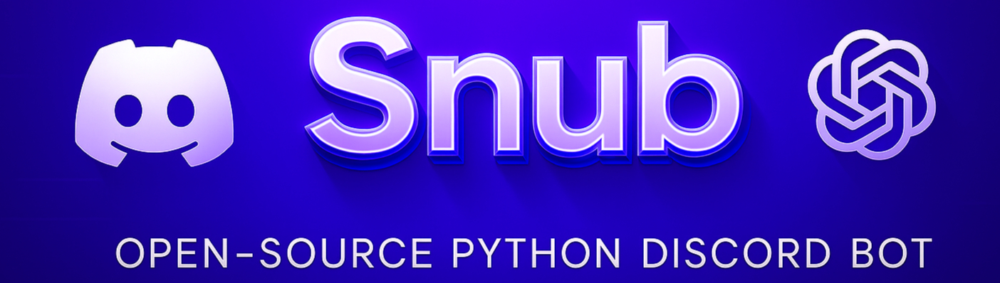

<div align="center">
  

# Snub Discord Bot

[](https://github.com/Rapptz/discord.py)
[](LICENSE)
[](https://discord.gg/qUD7JW5A94)
[](https://github.com/yourusername/Snub/stargazers)
[](https://github.com/psf/black)
[](https://www.docker.com/)
[]()

A powerful, modular Discord bot built with discord.py, featuring prefix commands, slash commands, reaction roles, tickets, birthday tracking, real-time countdowns, number facts, interactive "Would You Rather" questions, error logging, and more.
</div>

## 📚 Table of Contents
- [🚀 Getting Started](#-getting-started)
- [✨ Features](#-features)
- [🔧 Commands](#-commands)
- [📁 Project Structure](#-project-structure)
- [🏗️ AI Server Builder](#️-ai-server-builder)
- [🧩 Cog Management System](#-cog-management-system)
- [🔌 Adding More Commands](#-adding-more-commands)
- [🤝 Contributing](#-contributing)
- [📝 License](#-license)

## 🚀 Getting Started

### Prerequisites

- Python 3.8 or higher
- A Discord Bot Token ([Create a bot here](https://discord.com/developers/applications))
- Discord server with admin permissions
- Internet connection (for Numbers API integration)

### Installation

1. Clone the repository
   ```bash
   git clone https://github.com/yourusername/Snub.git
   cd Snub
   ```

2. Install dependencies
   ```bash
   pip install -r requirements.txt
   ```

### 🔧 Docker Setup (Optional)

For containerized deployment:

1. Create a Dockerfile in the project root:
   ```bash
   # Dockerfile (simple setup)
   FROM python:3.11-slim
   WORKDIR /bot
   COPY . .
   RUN pip install -r requirements.txt
   CMD ["python", "main.py"]
   ```

2. Build and run the container:
   ```bash
   docker build -t snubbot .
   docker run --env-file .env snubbot
   ```

3. Create a `.env` file in the root directory with your bot token and settings

   > ⚠️ **Important:** Never share your `.env` file or commit it to a public repo.

   ```
   DISCORD_TOKEN=your_bot_token_here
   PREFIX=!
   OWNER_IDS=123456789012345678,987654321098765432  # Comma-separated Discord user IDs for bot owners
   ACTIVITY_TYPE=listening
   ACTIVITY_NAME=commands
   ERROR_LOG_CHANNEL=channel_id_for_error_logs
   OPENAI_API_KEY=your_openai_api_key_here  # Required for AI features including wouldurather
   TICKET_WEBHOOK=your_webhook_url_here  # Optional: For ticket notifications
   ```

   **Environment Variables Reference:**

   | Variable | Description | Required |
   |----------|-------------|----------|
   | DISCORD_TOKEN | Your bot token | ✅ |
   | PREFIX | Command prefix (e.g., !) | ✅ |
   | OWNER_IDS | Comma-separated bot owner IDs | ✅ |
   | ACTIVITY_TYPE | Presence type (playing, watching, etc.) | ❌ |
   | ACTIVITY_NAME | Presence status name | ❌ |
   | ERROR_LOG_CHANNEL | Channel ID for error logs | ✅ |
   | OPENAI_API_KEY | OpenAI key for AI features | ✅ |
   | TICKET_WEBHOOK | Webhook URL for ticket logs | ❌ |

4. Run the bot
   ```bash
   python main.py
   ```

## ✨ Features

### Core Features
- 🧩 **Modular Design** - Organized cogs for easy maintenance and expansion
- 🔄 **Dynamic Cog Management** - Load, unload, and refresh cogs without restarting
- ⚙️ **Configurable** - Easy setup via environment variables
- 🎨 **Beautiful Embeds** - All responses use rich, colorful embeds
- 🔍 **Error Logging** - Comprehensive error tracking with Discord channel logging
- 📰 **Real-Time News** - Fetch latest headlines by topic or keyword
- 🧠 **Mental Health Check-In** - Private mood tracking with journaling prompts

### User Management
- 🎭 **Reaction Roles** - Self-service role assignment with buttons or dropdown menus
- 🔐 **Verification System** - Customizable member verification with role assignment
- 🎟️ **Ticket System** - Complete support ticket system with staff controls
- 🎂 **Birthday Tracking** - Track and celebrate member birthdays automatically
- 🤖 **AI Integration** - OpenAI-powered text and image generation
- ⏱️ **Countdown Timers** - Real-time countdown timers that update every second
- 🔢 **Number Facts** - Get interesting facts about numbers, dates, years, and math
- 🤔 **Would You Rather** - Interactive "Would You Rather" questions generated by AI
- 📨 **Invite Tracking** - Track who invited whom with detailed statistics and leaderboards
- 👪 **Family System** - Create virtual families with adoption, marriage, and family relationships
- 🏗️ **AI Server Builder** - Create complete server structures in seconds with AI-generated templates customized to your needs
- 💸 **Currency Converter & Crypto Tracker** - Convert between currencies and track cryptocurrency prices

### Server Management
- 📌 **Sticky Messages** - Pin important messages that reappear after new activity
- 🔍 **Slash Commands** - Modern Discord slash command support

## 🔧 Commands

### Slash Commands

<details>
<summary>📊 General Commands</summary>

| Command | Description | Permission |
|---------|-------------|------------|
| `/ping` | Check the bot's latency | Everyone |
| `/server-builder` | Build a complete Discord server with AI | Administrator |
</details>

<details>
<summary>🔢 Number Commands</summary>

| Command | Description | Permission |
|---------|-------------|------------|
| `/random_number_fact [category]` | Get a random number fact | Everyone |
| `/number_trivia <number>` | Get trivia about a specific number | Everyone |
| `/math_fact <number>` | Get a math fact about a number | Everyone |
| `/date_fact <month> <day>` | Get a fact about a specific date | Everyone |
| `/year_fact <year>` | Get a fact about a specific year | Everyone |
| `!number [number] [category]` | Get a fact about a number (hybrid command) | Everyone |
</details>

<details>
<summary>🎫 Ticket System</summary>

| Command | Description | Permission |
|---------|-------------|------------|
| `/ticket <issue>` | Create a new support ticket | Everyone |
| `/tickets` | View all active tickets | Admin |
| `/setup-tickets` | Set up the ticket system | Admin |
</details>

<details>
<summary>🔐 Verification System</summary>

| Command | Description | Permission |
|---------|-------------|------------|
| `!enableverify` | Enable the verification system | Admin |
| `!disableverify` | Disable the verification system | Admin |
| `!setverify <channel_id>` | Set the channel for verification | Admin |
| `!setverifyrole <@role>` | Set the role to assign upon verification | Admin |
</details>

<details>
<summary>🎭 Reaction Roles</summary>

| Command | Description | Permission |
|---------|-------------|------------|
| `/reactionrole-add <category> <role> <emoji>` | Add a role to a category | Manage Roles |
| `/reactionrole-button <category> [channel]` | Create a button panel | Manage Roles |
| `/reactionrole-menu <category> [channel]` | Create a dropdown menu panel | Manage Roles |
| `/reactionrole-list` | List all categories | Manage Roles |
| `/reactionrole-delete <category>` | Delete a category | Manage Roles |
</details>

### Text Commands

<details>
<summary>⚙️ Bot Management</summary>

| Command | Description | Permission |
|---------|-------------|------------|
| `!sync` | Sync slash commands with Discord | Owner |
| `!cogs` | List all available cogs and their status | Owner |
| `!cog load <name>` | Load a specific cog | Owner |
| `!cog unload <name>` | Unload a specific cog | Owner |
| `!cog refresh <name>` | Refresh (unload then load) a specific cog | Owner |
</details>

<details>
<summary>📌 Sticky Messages</summary>

| Command | Description | Permission |
|---------|-------------|------------|
| `!sticky set <message>` | Set a sticky message in the current channel | Manage Messages |
| `!sticky remove` | Remove the sticky message from the current channel | Manage Messages |
| `!sticky list` | List all sticky messages in the server | Manage Messages |
</details>

<details>
<summary>🎂 Birthday Commands</summary>

| Command | Description | Permission |
|---------|-------------|------------|
| `!birthday set <month> <day>` | Set your birthday | Everyone |
| `!birthday remove` | Remove your birthday | Everyone |
| `!birthday list` | List upcoming birthdays | Everyone |
| `!birthday next` | Show the next upcoming birthday | Everyone |
| `!birthday today` | Check if anyone has a birthday today | Everyone |
| `!birthday channel <#channel>` | Set birthday announcement channel | Admin |
</details>

<details>
<summary>💸 Currency & Crypto Commands</summary>

| Command | Description | Permission |
|---------|-------------|------------|
| `!convert <amount> <from_currency> <to_currency>` | Convert between currencies | Everyone |
| `!crypto <symbol>` | Get cryptocurrency prices in USD, EUR, and BTC | Everyone |
| `!currencies` | List all supported currency codes | Everyone |
| `!rate <from_currency> <to_currency>` | Check exchange rate between currencies | Everyone |
</details>

<details>
<summary>🧠 Mental Health Commands</summary>

| Command | Description | Permission |
|---------|-------------|------------|
| `!checkin` | Start a mental health check-in conversation | Everyone |
| `!mood <description>` | Record your current mood | Everyone |
| `!moodhistory [days]` | View your mood history (defaults to 7 days) | Everyone |
| `!prompt [category]` | Get a journaling prompt (optional categories: general, anxiety, depression, stress, motivation) | Everyone |
| `!addprompt <category> <prompt>` | Add a new journaling prompt to a category | Admin |
| `!remindmecheckin <frequency> <time>` | Set daily/weekly mental health check-in reminders (frequency: daily/weekly, time: 24h format) | Everyone |
| `!stopcheckinreminder` | Stop your mental health check-in reminders | Everyone |
| `!exportmoods [format]` | Export your mood history as CSV or JSON (defaults to CSV) | Everyone |
| `!comparemood @user` | Compare your mood patterns with another user | Everyone |
| `!suggestactivity [mood]` | Get activity suggestions based on mood (optional: positive/neutral/negative) | Everyone |
| `!deletelog` | Delete all your mood history (requires confirmation) | Everyone |
</details>

## 📁 Project Structure

```
.
├── main.py           # Bot entry point
├── config.py         # Configuration loader
├── requirements.txt  # Dependencies
├── .env              # Environment variables (create this)
├── data/             # Data storage directory
│   ├── birthdays.json
│   ├── conversation_memory.json
│   ├── family.json
│   ├── invites.json
│   ├── reaction_roles.json
│   ├── sticky_messages.json
│   ├── tickets.json
│   ├── verification_config.json
│   └── wouldurather_questions.json
└── cogs/             # Bot command modules
    ├── help.py           # Custom help command
    ├── ping.py           # Latency check
    ├── cogmanager.py     # Cog management
    ├── sync.py           # Slash command sync
    ├── numbers.py        # Number facts
    ├── reactionroles.py  # Self-assignable roles
    ├── tickets.py        # Ticket system
    ├── verification.py   # User verification system
    ├── birthdays.py      # Birthday tracking
    ├── family.py         # Virtual family system
    ├── invites.py        # Invite tracking
    ├── stickymessages.py # Auto-reposting messages
    ├── openai.py         # AI integration
    ├── wouldurather.py   # Would you rather game
    ├── error_logger.py   # Error tracking
    ├── server_builder.py  # AI server builder
    ├── currency.py        # Currency converter & crypto tracker
    ├── news.py            # Real-time news fetcher
    └── mentalhealth.py    # Mental health check-in system
```

## 🏗️ AI Server Builder

The AI Server Builder is a powerful feature that allows server administrators to quickly create complete Discord server structures using artificial intelligence. This feature leverages OpenAI's GPT-4o model to generate server layouts tailored to your specific needs.

### How to Use the Server Builder

1. Use the `/server-builder` slash command to start the process
2. Follow the interactive UI to select:
   - **Server Type**: Choose from Gaming, Community, Education, Business, Creative, Tech, Entertainment, or Social
   - **Member Scale**: Select Small, Medium, or Large based on expected server size
   - **Moderation Level**: Choose Low, Medium, or High based on desired strictness
   - **Focus Areas**: Select up to 8 areas your server will focus on (e.g., Discussions, Voice Channels, Events)
3. Optionally add custom input to further personalize your server:
   - Provide a detailed server description
   - Request special features or specific channel structures
4. Click "Build Server" to generate and create your server structure

The AI will create a complete server with:
- Properly named categories (using Discord's modern ALL CAPS convention)
- Text and voice channels with appropriate emojis and naming conventions
- Forum and stage channels (if supported by your server)
- Server roles with permissions
- Default channels like rules, welcome, announcements, and self-roles
- Recommended bots for your server type

## 🧩 Cog Management System

The bot features a dynamic cog management system that allows loading, unloading, and refreshing cogs without restarting the bot. This is particularly useful for development and maintenance.

- Use `!cogs` to see all available cogs and their current status
- Use `!cog load <n>` to load a specific cog
- Use `!cog unload <n>` to unload a specific cog
- Use `!cog refresh <n>` to refresh a cog (unload then load)

All cog management commands are restricted to bot owners for security.

> **Example: Loading a Cog**
> ```bash
> !cog load birthdays
> ```

## 🔌 Adding More Commands

To add more commands, create new cogs in the `cogs` directory. Each cog should have a single responsibility and be named according to its function. Once created, you can load the new cog using the cog management system without restarting the bot.

### Cog Descriptions

Here's a brief overview of the available cogs:

- `help.py` - Custom help command with categorized commands and detailed usage information
- `openai.py` - AI-powered text and image generation using OpenAI's GPT and DALL-E models
- `family.py` - Virtual family system with adoption, marriage, and family relationship management
- `invites.py` - Tracks who invited whom with detailed statistics and leaderboard generation

### Command Examples

> **Example: Setting a Birthday**
> ```bash
> /birthday set 12 25
> ```

> **Example: Creating a Sticky Message**
> ```bash
> !sticky set Welcome to the server! Please verify to access channels.
> ```

> **Example: Generating AI Image**
> ```bash
> /imagine a cyberpunk cityscape with neon lights
> ```

> **Example: Fetching News**
> ```bash
> !news tech
> !news search "discord bots"
> ```

> **Example: Mental Health Check-In**
> ```bash
> !checkin
> !mood feeling better today
> !prompt anxiety
> !remindmecheckin daily 20:00
> !suggestactivity
> !exportmoods csv
> ```

## 🤝 Contributing

Contributions are welcome! Here's how you can help:

1. Fork the repository
2. Create a feature branch (`git checkout -b feature/amazing-feature`)
3. Commit your changes (`git commit -m 'Add some amazing feature'`)
4. Push to the branch (`git push origin feature/amazing-feature`)
5. Open a Pull Request

## 📝 License

Distributed under the MIT License. See `LICENSE` for more information.
# snub
